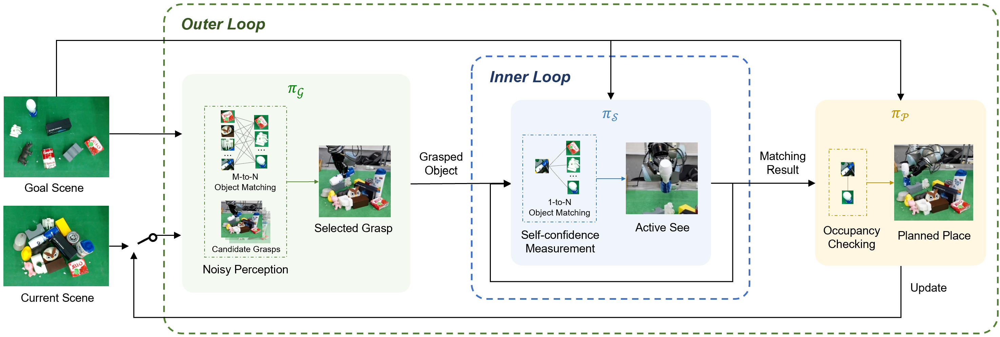

# Grasp, See and Place: Efficient Unknown Object Rearrangement with Policy Structure Prior
This is the official repository for the paper: Grasp, See and Place: Efficient Unknown Object Rearrangement with Policy Structure Prior.

[Paper](https://arxiv.org/abs/2402.15402)

We focus on the task of unknown object rearrangement, where a robot is supposed to re-configure the objects into a desired goal configuration specified by an RGB-D image. Recent works explore unknown object rearrangement systems by incorporating learning-based perception modules. However, they are sensitive to perception error, and pay less attention to task-level performance. In this paper, we aim to develop an effective system for unknown object rearrangement amidst perception noise. We theoretically reveal the noisy perception impacts grasp and place in a decoupled way, and show such a decoupled structure is non-trivial to improve task optimality. We propose GSP, a dual-loop system with the decoupled structure as prior. For the inner loop, we learn an active seeing policy for self-confident object matching to improve the perception of place. For the outer loop, we learn a grasp policy aware of object matching and grasp capability guided by task-level rewards. We leverage the foundation model CLIP for object matching, policy learning and self-termination. A series of experiments indicate that GSP can conduct unknown object rearrangement with higher completion rate and less steps.



#### Contact

Any question, please let me know: kcxu@zju.edu.cn

## Citation

If you find this work useful, please consider citing:

```
@article{xu2024grasp,
  title={Grasp, See and Place: Efficient Unknown Object Rearrangement with Policy Structure Prior},
  author={Xu, Kechun and Zhou, Zhongxiang and Wu, Jun and Lu, Haojian and Wang, Yue and Xiong, Rong},
  journal={arXiv preprint arXiv:2402.15402},
  year={2024}
}
```